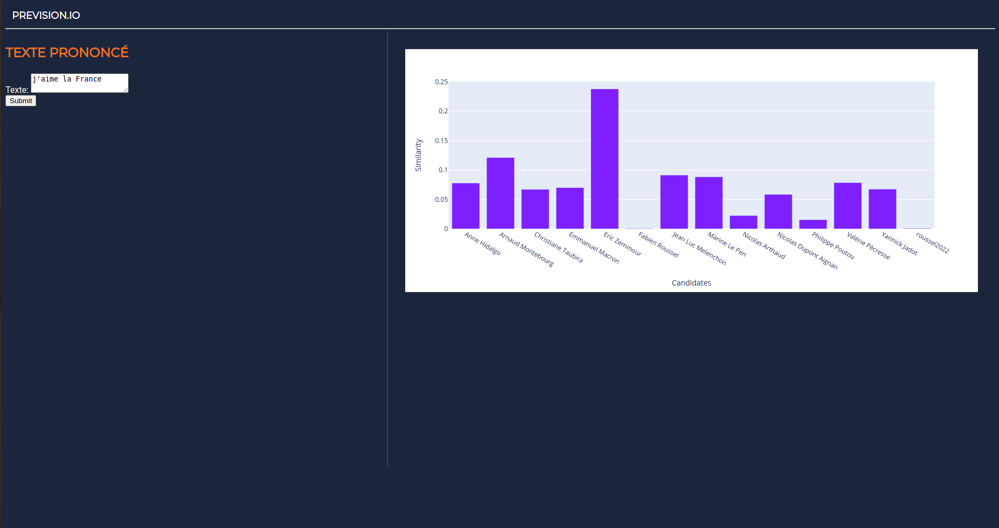
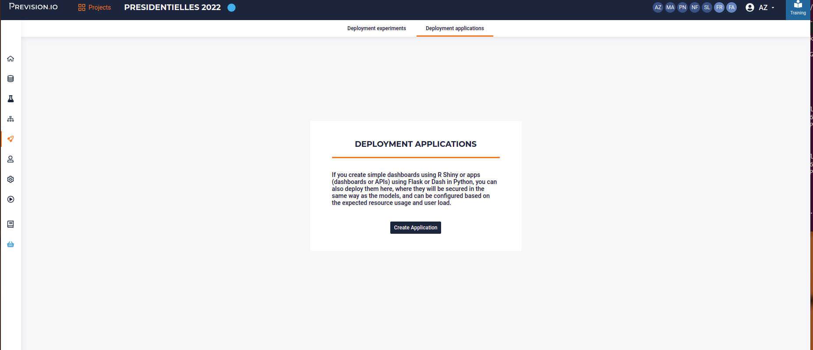
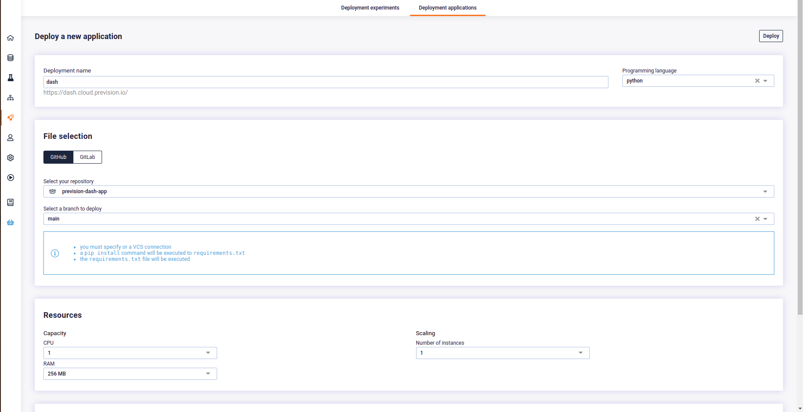
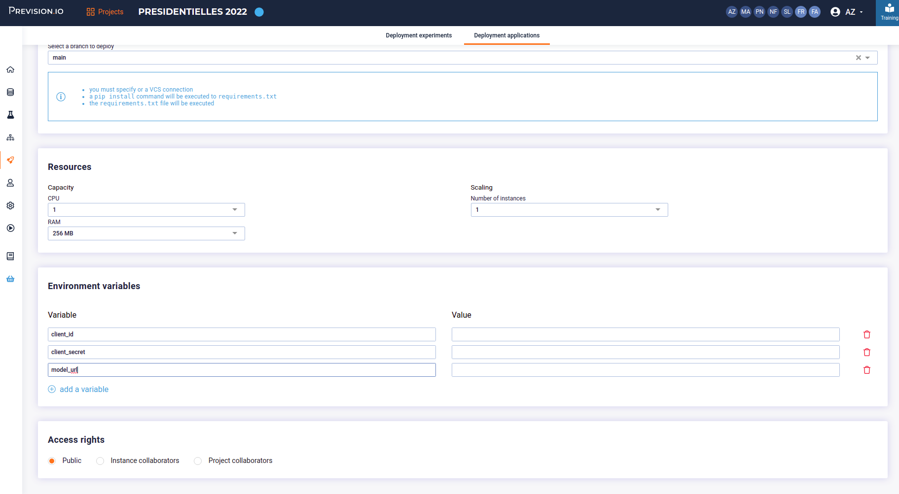

# prevision-dash-app

Dash, and plotly, are perfect candidate for exposing models and predictions to the world. In this guide, I am showing you how to deploy a Dash project that use a Prevision Model into Previsio Studio.

We are building a very simple app that :

- call a multiclass model with a text input
- get the result and diplay the probability of each class as a bar chart

## Prerequiste

You need a git repo to deploy your app

## Project architecture

You can clone this project to get a boilerplate :

`git clone https://github.com/previsionio/prevision-dash-app.git`

and inspect the project folder tree. 

### Required 

In order to deploy your project to Prevision.io platform you **must** have :
- a requirements.txt file ( with all your requirements obviously) at the root of the projects
- a `run.py` file , at the root too

### Advised 

A simple but efficient folder structure is :

- a service folder, with all your api call ( and a model.py file for calling  prevision model )
- an asset folder with your css ( for example `layout.css` and `styles.css` )


## Setup

In order to create a dev environnement to code and test your application :


- create a virtual env
- activate it ̀
- install requirements
    - pandas
    - plotly-express
    - dash
    - gunicorn
- fill the .env file with your model url, id and secret ( get it on [the deployed model page](https://previsionio-previsionio.readthedocs-hosted.com/en/latest/studio/deployments/index.html#inspect-and-monitor-a-deployed-experiment) )
- launch the app with gunicorn


```
git clone https://github.com/previsionio/prevision-dash-app.git
cd prevision-dash-app
python -m venv env
source env/bin/activate
pip install -r requirements.txt 
gunicorn --bind 0.0.0.0:8080  --threads 10 -w 2 --timeout 120 --limit-request-line 0 --access-logfile - run:app
```

If everything works fine, you could open (http://localhost:8080) with yoour browser and you should see a simple interactive dashboard




### Warning

Your app must work the following option :

`gunicorn --bind 0.0.0.0:8080  --threads 10 -w 2 --timeout 120 --limit-request-line 0 --access-logfile - run:app`

(*if you work on windows setup you can use waitress server instead*)

Check that you "main" file is named `run.py` and that the dash app server is bind to the app variable :

```
dashboard = dash.Dash(__name__) 
app = dashboard.server
```

Moreover, you should try your app with the -w 2 option to be sure that it is truly stateless and can run in many thread.

## Calling the model

If you want to use a Model hosted on prevision platform, you need to initialize a request-oauthlib client. Do it in the `services/model`file.

You should have your credentials in a .env file 

```python

load_dotenv()
client_id = os.getenv('client_id')
client_secret = os.getenv('client_secret')
model_url = os.getenv('model_url')

client = BackendApplicationClient(client_id=client_id)

```

Then write a function that send the form data as a `POST` request json payload. Here the model has only one feature, `text` but you need to change this accordong to your model feature

```python
def send(text):

    try:
        predict_url = f"{model_url}/predict"

        payload = json.dumps({
            "text": text
        })
        headers = {'Content-Type': 'application/json'}

        oauth = OAuth2Session(client=client)
        oauth.fetch_token(
            token_url=
            'https://accounts.prevision.io/auth/realms/prevision.io/protocol/openid-connect/token',
            client_id=client_id,
            client_secret=client_secret)

        prediction = oauth.post(predict_url, headers=headers, data=payload)
        res = prediction
        data=res.json()

        # You can transform the response to help the client
        pred = transformres(data)
        
        return pred
    except ConnectionError:
        logging.error("Cannot call model")
        return {}
```

## Building the Dashboard

The dashboard is a basic interactive app  with a form and a chart. When submit button event is triggererd, the state of the form is send to the model and the response is use to update chart data 

```python
# Initialise the app 
dashboard = dash.Dash(__name__) 

# just  a test
default_text="j'aime la France"
res = model.predict_query(default_text)
print(res)

df = pd.DataFrame({
    "Candidates": [candidate["name"] for candidate in res["predictions"]],
    "Similarity": [candidate["similarity"] for candidate in res["predictions"]],

})

# Define the app Layout here
dashboard.title = 'Analytics Dashboard'

fig = px.bar(df, x="Candidates", y="Similarity", barmode="group")

form = html.Div([
    html.H3("Texte prononcé"),
    html.Div([
        "Texte: ",
        dcc.Textarea(id='src-txt', value=default_text  )
    ]),
    html.Button('Submit', id='submit-val', n_clicks=0)    

])

panelling = html.Div([html.Main(children= [form]), html.Aside(children=    dcc.Graph(
        id='barchart',
        figure=fig
    ),)], className='vertical-panelling')


dashboard.layout = html.Div(children=[
    html.Header(children=html.H1(children = 'Prevision.io')),
    panelling,
    html.Footer(children="Copyright")
], id="container")


# A callback that listn to form submit and call the model
def init_callbacks(dash_app):
    @dashboard.callback(
    Output('barchart', 'figure'),
    Input('submit-val', 'n_clicks'),
    State('src-txt', 'value')    
    )
    def update_graph(n_clicks, value):
        res = model.predict_query(value)
        df = pd.DataFrame({
            "Candidates": [candidate["name"] for candidate in res["predictions"]],
            "Similarity": [candidate["similarity"] for candidate in res["predictions"]],

        })
        fig = px.bar(df, x="Candidates", y="Similarity")
        fig.update_layout(transition_duration=500)
        return fig


init_callbacks(dashboard)
app = dashboard.server
```

## Deploying the app in prevision env

Once everything works locally, put your code into your repo. 

You need to give authorization to Prevision.io platform.  Connect to Prevision.io and go to `profile > federated identity`. add you gitlab or github repo then :


Go to `Deployments > Deployment applications`. Click 'create application'



Fill the form. Plotly is a python framework so choose `python` as programming language. Select your repo and folder


Do not forget to create 3 env variable and fill them with your credentials ( or more if you add some to your project)



Click Deploy button and wait. Your application should be available in a few minutes, to the url provided in the interface. If something failed, error logs are available in the `log`tab of the deployment page.